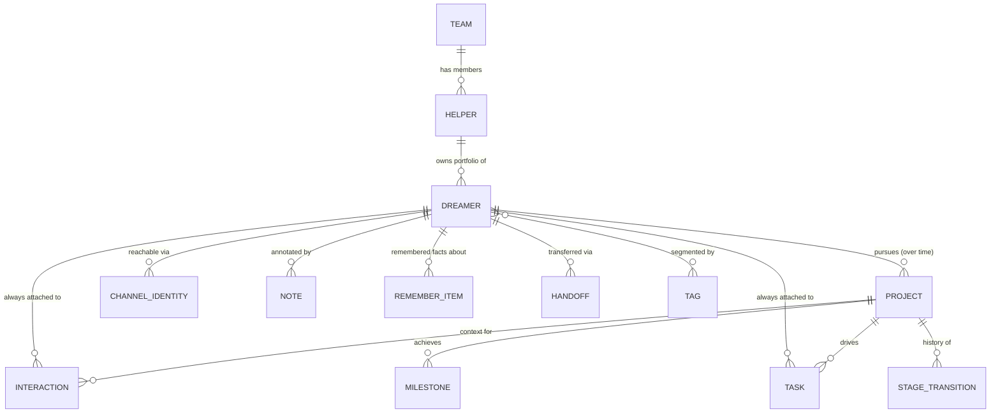

# Dreamers CRM — Product Requirements Document

**A HubSpot-style CRM for HelpBnk, built to track people you're helping — not people you're selling to.**

Version 1.0 · Draft for team review

---

## Table of Contents

1. [Vision & Principles](#1-vision--principles)
2. [Glossary](#2-glossary)
3. [Personas & Jobs-to-be-Done](#3-personas--jobs-to-be-done)
4. [The Method](#4-the-method)
5. [Rituals](#5-rituals-daily-weekly-monthly)
6. [Data Model](#6-data-model)
7. [Screens & UX](#7-screens--ux)
8. [Team Layer](#8-team-layer)
9. [Creative Differentiators](#9-creative-differentiators)
10. [Anti-Patterns (Hard Requirements)](#10-anti-patterns-hard-requirements)
11. [Privacy, Safeguarding & Compliance](#11-privacy-safeguarding--compliance)
12. [Metrics & Reporting](#12-metrics--reporting)
13. [Phasing: MVP → V1.1 → V2](#13-phasing-mvp--v11--v2)
14. [Tech Stack & NFRs](#14-tech-stack--nfrs)
15. [Risks & Week-1 Validation](#15-risks--week-1-validation)

---

## 1. Vision & Principles

HelpBnk helps people pursue their dreams — starting businesses, building skills, changing their lives — with no expectation of anything in return. The people asking for help are **Dreamers**. The people helping them are **Helpers**, working in a small team of 2–10, each carrying a portfolio of Dreamers over months or years.

Today that relationship is tracked in someone's head, a spreadsheet, and a WhatsApp thread. People fall through the cracks not from lack of care, but from lack of a system. **Dreamers CRM borrows the operational discipline of a sales CRM — organized records, pipelines, next-action enforcement, cadence tracking, team dashboards — and repoints all of it at generosity instead of revenue.**

This is deliberately **"a commercial method for good"**: the rigor of sales ops, applied to helping people, with success measured in Dreamer progress and relationship health, not currency.

### 1.1 Method principles

1. **Every active Dreamer has a next step.** A Dreamer with no scheduled next touch is, by definition, being forgotten. The system makes that state visible and hard to sustain.
2. **Silence is data, not rejection.** A Dreamer going quiet triggers a structured, kind re-engagement approach — never a shrug, never a guilt trip.
3. **Stages describe the Dreamer's journey, not our convenience.** A project only advances when something real happened for the Dreamer.
4. **The helper's daily queue is the product.** The core surface isn't a database — it's "who do I contact today."
5. **Won = the Dreamer no longer needs us.** Graduation is the win condition, defined without revenue, and recorded with the same rigor a sales team gives a closed deal.

The method, printed on the empty state of the daily queue:

> **"Nobody who asked for help gets forgotten here."**

### 1.2 What this is not

Not a marketing automation tool. Not a helper-performance surveillance system. Not a place where Dreamers are graded, ranked, or nudged by anything that isn't a human being who knows their name.

---

## 2. Glossary

Five design lenses independently invented five vocabularies. This is the one that ships — internal schema names stay technical; user-facing copy uses the right column always.

| Internal / schema term | User-facing label | Notes |
|---|---|---|
| Dreamer (Contact-analog) | **Dreamer** | Same word, schema and UI |
| Project (Deal-analog) | **Dream** | "Sofia's dream: mobile dog-grooming van" |
| Task / Next Action | **Next Step** | Not "Promise" — see §10 |
| Owner (primary helper) | Helper, or **First Believer** (profile flourish only) | "First Believer" appears once, on the profile badge — not throughout the UI |
| Closed-won | **Graduated** | |
| Closed-lost (dream stalled, no shame) | **Resting** (paused, door open) or **Redirected** (pivoted to a new Dream) | "Lost" never appears anywhere |
| Pipeline | Journey | Used sparingly; "stage" is fine in most UI |
| Interaction / Activity | Touchpoint | |

**Words banned from all UI copy:** lead, prospect, deal, deal value, close, closed-lost, churn, pipeline value, quota.

---

## 3. Personas & Jobs-to-be-Done

**Helper** (2–10 people). Job: know who to contact today, log the touch in seconds, never lose the thread on a relationship, feel like the tool has their back — not their manager watching over their shoulder.

**Team Lead** (1, sometimes a helper wearing two hats). Job: see the whole team's portfolio health in one screen weekly, catch Dreamers falling through the cracks regardless of whose portfolio they're in, run productive 1:1s, and produce a monthly impact story for the wider org.

**Viewer** (V1.1, optional — e.g. the HelpBnk founder). Job: see aggregate impact without touching individual records.

---

## 4. The Method

### 4.1 The pipeline (canonical — one stage set, used everywhere in this document)

The pipeline applies to the **Dream** (the deal-like object). One Dreamer can have multiple Dreams, sequentially or in parallel, over their lifetime relationship with HelpBnk.

| # | Stage | Definition | Entry criteria | Exit criteria (to advance) | Target duration | Contact cadence |
|---|---|---|---|---|---|---|
| 1 | **Intake** | Request received, not yet assessed | Dream record created (HelpBnk DM, doorbell, event, referral, social) | Triage touch completed; dream statement + current blocker captured | ≤ 5 days | First touch ≤ **48h** |
| 2 | **Discovery** | Understanding the person, the dream, what help actually fits | Helper assigned | Discovery conversation logged; a help plan (goal + first milestones) drafted and confirmed by the Dreamer | ≤ 14 days | Every **5 days** |
| 3 | **Active Help** | Dreamer is doing the work; helper is mentoring/unblocking | Help plan agreed, first milestone dated | All plan milestones done, or a launch milestone is within 30 days | 4–16 weeks | Every **7 days** |
| 4 | **Launch Support** | The dream is going live — first sale, launch event, registration | A launch milestone dated within 30 days | Launch happened; post-launch check-in logged | 2–6 weeks | Every **5 days** (launches are fragile) |
| 5 | **Momentum** | Post-launch stabilization; deciding if they still need us | Launch confirmed | Two consecutive positive check-ins with no new blocker, OR a new blocker found (→ back to Active Help) | 4–8 weeks | Every **14 days** |
| 6 | **Graduated** (terminal, won) | Success outcome achieved and recorded | Graduation form completed (§4.4) | — | — | Alumni cadence: 90 days, optional |

Terminal non-graduation states: **Closed – Referred** (better served elsewhere, with `referred_to` note) and **Closed – Unresponsive** (never reachable, even at Intake).

These cadence and stage-duration values live in one `stage_config` table, team-configurable, not hardcoded — a lead will want to tune them after a month of real data.

### 4.2 Statuses (overlay a stage — not a separate lifecycle)

A Dream in `Active Help` can simultaneously carry a status. This keeps reporting honest: you see *where* they are and *why* they're not moving, in the same glance.

| Status | Trigger | Cadence behavior | Auto-transition |
|---|---|---|---|
| `active` (default) | — | Stage cadence applies | — |
| `waiting_on_dreamer` | Helper sets it, with a `waiting_for` note — the ball is in the Dreamer's court | Clock **keeps running, visibly, but doesn't alarm**; a check-in nudge fires at day 7 regardless | No reply 14 days after nudge → suggest `ghosted` |
| `paused` | Dreamer explicitly asked for a break, with `pause_reason` + `resume_date` (max 90 days out) | SLAs suspended | 7 days before `resume_date`, a "warm restart" next step is auto-created |
| `ghosted` | Re-engagement sequence exhausted, no response | Excluded from active portfolio counts | Any inbound contact → `re_engaged` |
| `re_engaged` | Dreamer resurfaced after ghosted/dormant | Helper gets a next step: "Welcome back — re-validate the plan," due 5 days | Once logged, returns to `active` in the stage they left (helper confirms) |
| `dormant` | 90+ days ghosted, or Dreamer said "not now" | None active; quarterly "door is open" digest eligible | Inbound contact → `re_engaged` |

**Design rule:** `waiting_on_dreamer` and `paused` genuinely pause the clock — but the clock is still shown, never hidden, and a lead view caps how much of a portfolio can sit in these statuses at once (see §12 gaming countermeasures) so they can't become a place to park neglected Dreamers.

Stage regressions (e.g. `Momentum → Active Help` when a new blocker appears) are legal, one click, require a short `regression_reason`, and are never treated as a failure — they're logged and counted as signal in monthly reporting.

### 4.3 Next-step discipline (the iron rule)

> **Every Dream with status `active` must have exactly one open Next Step, with an owner and a due date.**

This is enforced two ways:
- **Schema-level:** a partial unique index ensures at most one `is_next_action = true` task per active Dream.
- **UX-level:** closing a touchpoint log requires either (a) a next step with a date, or (b) an explicit status change (`waiting_on_dreamer`, `paused`, or a close/graduate flow) — you can only skip a next step by declaring the Dream isn't actively being worked right now.

An honest escape hatch: if the helper genuinely doesn't know what's next yet, "Decide tomorrow" creates a next step titled *"Decide next step"* due +1 day. This keeps the invariant true without forcing a lie about status.

New Dream creation auto-creates Next Step #1: *"Make first contact,"* due +48h.

### 4.4 Definitions of "won" — graduation without revenue

Graduation requires selecting at least one **success outcome** (multi-select, with evidence text):

| Outcome | Example evidence |
|---|---|
| `first_revenue` | "Sold 14 jars at Camden market, £84" |
| `launched` | Product/service/venture publicly live — URL, date, photo |
| `registered` | Business legally formed — company number |
| `funded` | Grant, investment, or loan secured |
| `first_hire_or_partner` | Took on a first collaborator |
| `skill_unlocked` | Can now do the thing they couldn't (pitch, price, build) — helper attestation + example |
| `plan_to_action` | Executing a validated plan solo — 3+ self-completed milestones in a row |
| `redirected_well` | Discovered this dream wasn't it, chose a better path deliberately — **this is a win, recorded as one** |
| `pays_it_forward` | Became a mentor to another Dreamer |

**The graduation test** (shown in-product as guidance): *"Would this Dreamer keep moving without us? If yes for two consecutive Momentum check-ins — graduate them. Holding on longer serves us, not them."*

**Graduation form** (required to close): success outcomes + evidence, a 3–5 sentence graduation story (feeds the Wins feed and monthly report), optional Dreamer quote with consent, time-to-graduation (auto-computed), helper reflection ("what helped most"), alumni opt-in.

**Alumni loop:** opted-in graduates get a soft 90-day check-in cadence (shows in Moments, never in Overdue), anniversary nudges, and can start a *new* Dream on the same Dreamer record — the lifetime view shows the full arc: *"Sofia: Food stall (Graduated 2026) → Catering business (Discovery 2027)."*

### 4.5 Re-engagement — when a Dreamer goes quiet

Triggered when `waiting_on_dreamer` passes 14 days post-nudge, or a Dream no-shows twice. **This ships as a template library the helper chooses from and personally sends — not an automated sequence engine.** (The MVP-scoping critique flagged a full sequence-engine-with-efficacy-tracking as premature automation for a 2–10 person team; templates deliver the value at a fraction of the build cost.)

**"Still Here" message templates**, staged by tone:

| Moment | Tone & template gist |
|---|---|
| Gentle nudge | Low-pressure: *"Hey Maya — no rush, just checking how the pitch deck's going. Anything I can take off your plate?"* |
| Value-add touch | Give, don't ask: *"Saw this and thought of your food stall idea — [link]. Zero pressure to reply."* |
| Direct, warm check | Names the silence kindly, offers `paused` as a legitimate answer: *"It feels like life got busy — totally normal. Want to pause this for a bit, or keep going? Either answer is a good answer."* |
| Open-door close | The anti-break-up: *"I'll stop nudging so I'm not noise in your inbox. But this door doesn't close — reply any day, this year or next, and we pick up where we left off."* → moves to `ghosted` once sent. |

A "gone quiet" section in the daily queue surfaces who's due for one of these; any inbound reply at any point cancels the sequence and flips status to `re_engaged`.

---

## 5. Rituals (Daily, Weekly, Monthly)

### 5.1 Daily — the Today queue

The helper's home screen (see §7.1 for full UI spec). Three sections, in priority order: **Overdue**, **Due today**, **Going quiet** (Dreams whose last-contact age exceeds stage cadence but have no scheduled next step). V1.1 adds a **Moments** section (birthdays, launch anniversaries, milestone anniversaries).

Deliberately *not* a 25-item, clear-by-end-of-day gamified list — the adoption critique flagged that framing as burnout design. The queue is finite and ordered, not a scoreboard.

### 5.2 Weekly — the Monday digest (read-only)

A generated summary the helper reads, not a mandatory interactive form: movement (Dreams that changed stage), the at-risk list for their portfolio, gone-quiet Dreams, and wins logged. One optional one-click action: **"Plan stands"** to acknowledge an at-risk Dream without opening it. No completion stamp, no tracked "did you review" metric — a small team reviews itself in conversation; the software's job is to prep the agenda, not take attendance.

The team-wide version of this feeds the lead's weekly team review (30 minutes, agenda auto-generated): wins, at-risk roundtable, stuck stages, capacity check, one exemplar story of the week.

### 5.3 Monthly — impact review (V2)

Auto-generated "What moved for Dreamers this month": graduations with stories, pipeline flow (entered/advanced/regressed/ghosted/re-engaged per stage), cohort trends (average days-in-stage vs. prior months, where projects stall), portfolio balance, reactivation efficacy. Explicitly no revenue-proxy framing anywhere in the report.

---

## 6. Data Model

Assumes Postgres. Every table gets `id UUID PK`, `created_at`, `updated_at`, `archived_at` (soft delete) unless noted.

### 6.1 Object map



### 6.2 `dreamer` — the person being helped

| Field | Type | Example / notes |
|---|---|---|
| `first_name`, `last_name` | text | last name optional — many arrive as a first name on WhatsApp |
| `preferred_name` | text | what helpers actually call them |
| `location_city`, `location_country` | text, char(2) | |
| `timezone` | text | drives "don't nudge at 3am" logic |
| `source` | enum | `helpbnk_dm`, `doorbell`, `event`, `social_dm`, `referral`, `walk_in`, `other` |
| `dream_statement` | text | the headline dream in the Dreamer's own words |
| `owner_id` | FK → helper | exactly one owner at a time |
| `bio_context` | text | human context before every call — "single mum, works nights, has £2k saved" |
| `communication_preference` | enum | drives quick-log channel default |
| `consent_contact`, `consent_story_sharing`, `sensitivity_flag`, `do_not_contact_until` | see §11 | |
| `date_of_birth`, `guardian_consent_at` | date, nullable | minors safeguarding — §11.2 |
| `lifecycle_rollup` | enum, **derived, read-only** | rolled up from the Dreamer's Dreams' statuses — not an independently settable field (resolves a data-model/method conflict: statuses live on the Dream, per §4.2) |

### 6.3 `project` (Dream) — the deal-analog

| Field | Type | Example / notes |
|---|---|---|
| `dreamer_id` | FK | required |
| `title`, `description` | text | |
| `stage` | enum | the 6 canonical stages, §4.1 |
| `status` | enum | `active`/`waiting_on_dreamer`/`paused`/`ghosted`/`re_engaged`/`dormant`, §4.2 |
| `stage_entered_at` | timestamptz | set on every transition |
| `owner_id` | FK → helper | usually = dreamer.owner_id, can differ for specialist help |
| `north_star` | text | one concrete, checkable success definition — "First paying customer by Oct 1" |
| `north_star_target_date` | date | |
| `plan_steps` | jsonb | 3–7 checkboxes for the current help plan; % complete derived |
| `outcome`, `outcome_note` | enum, text | set only on close: `achieved`, `partially_achieved`, `dreamer_pivoted`, `dreamer_stepped_back`, `we_couldnt_help` |

### 6.4 `interaction` (Touchpoint) — every logged contact

The highest-volume table; optimized for the ≤15-second quick-log (§7.5).

| Field | Type | Notes |
|---|---|---|
| `dreamer_id` | FK, required | always set |
| `project_id` | FK, nullable | a person-level check-in may not be project-scoped |
| `helper_id` | FK | who had the interaction |
| `channel` | enum | `whatsapp`, `email`, `video_call`, `phone_call`, `in_person`, `helpbnk_dm`, `voice_note`, `social_dm`, `other` |
| `direction` | enum | `outbound`, `inbound`, `mutual` |
| `occurred_at` | timestamptz | defaults to now, editable for backfill (natural-language parsing: "yesterday") |
| `summary` | text | 1–3 sentences, the one required field |
| `outcome` | enum | one merged taxonomy: `progressed`, `no_change`, `new_blocker`, `no_show`, `dreamer_win`, `concern_flag` — optional, behind "+ more" |
| `counts_as_contact` | bool | false for e.g. "viewed her Instagram" — keeps `last_contact_at` honest |
| `commitments` | jsonb | who-promised-what-by-when, each one-tap-converts to a `task` |

**No 24-hour edit lock** — the adoption critique correctly flagged this as punishing normal Sunday-night batch-logging behavior. Instead: edit history (`edited_by`, `edited_at`), visible on hover, no lock.

### 6.5 `task` (Next Step)

| Field | Type | Notes |
|---|---|---|
| `dreamer_id` / `project_id` | FK | project nullable |
| `assignee_id` | FK → helper | |
| `title`, `due_at` | text, timestamptz | required |
| `is_next_action` | bool | partial unique index: one per active Dream |
| `waiting_on` | enum | `helper`, `dreamer`, `third_party` |
| `status` | enum | `open`, `done`, `cancelled` |
| `source_interaction_id` | FK | provenance |
| `snooze_count` | int | 3+ on the same task → amber flag, feeds the "junk action" tripwire (§15) |

### 6.6 `note`

`dreamer_id`/`project_id` (nullable), `author_id`, `body` (markdown), `is_pinned`, `visibility` (`team` default, `owner_and_lead` for sensitive notes). Notes are context; interactions are events — kept visually distinct so a note never masquerades as a logged contact.

### 6.7 `milestone`

One table (not the four competing shapes the design lenses produced independently): `project_id`, `type` (from a taxonomy — business milestones like `first_sale`, `business_registered`; personal-courage milestones like `first_public_pitch`, `came_back_after_setback`), `custom_label`, `occurred_at`, `evidence_url`, `story_note`, `consent_to_share` (`private`/`team`/`public`). Feeds the team Wins feed.

### 6.8 `remember_item` — "Remember This"

The MVP-critical give-back feature (see §9.2 and §15).

`dreamer_id`, `category` (`family`/`dates`/`fears`/`joys`/`preferences`/`context`), `fact_text` (e.g. "Daughter Lina, 7, obsessed with dinosaurs"), `resurface_on` (nullable date — birthday, launch day), `source_interaction_id`. **Fear-category items are excluded from all exports and story drafts regardless of other consent flags** — a hard rule, not a toggle.

### 6.9 `helper`, `team`, `tag`, `channel_identity`, `stage_transition`, `handoff`, `audit_log`

- **helper**: `full_name`, `email`, `role` (`helper`/`lead` — MVP has just these two, per the roles conflict resolution), `specialties[]`, `timezone`, `status` (`active`/`away`/`left`).
- **team**: `name`, `stage_config` (cadence/duration overrides).
- **tag** + `dreamer_tag`: flat, team-scoped, `kind` discriminator (`theme`/`program`/`flag`).
- **channel_identity**: `dreamer_id`, `channel`, `handle`, `is_primary` — powers duplicate detection (§13) and future integration matching.
- **stage_transition**: immutable log — `project_id`, `from_stage`, `to_stage`, `changed_by`, `reason`, `occurred_at`.
- **handoff**: see §8.3.
- **audit_log**: append-only — reassignment, private-note break-glass access, export, GDPR erasure, threshold changes. One table, trivial cost, required by §11.

### 6.10 Computed fields

Computed nightly and incrementally on relevant writes; formulas are the spec.

| Field | Scope | Formula |
|---|---|---|
| `last_contact_at` | dreamer, project | `MAX(interaction.occurred_at) WHERE counts_as_contact` — outbound or inbound |
| `last_reply_at` | dreamer | Same, but `direction IN ('inbound','mutual')` — this is what Coverage (§12) is measured against, not raw contact |
| `days_since_contact` | dreamer, project | `now() − last_contact_at`; never-contacted flagged separately |
| `next_action_due` | dreamer, project | `MIN(task.due_at) WHERE status='open'`; null ⇒ "adrift," its own queue alert |
| `cadence_overdue_days` | project | `days_since_contact − stage_config.cadence_days` (0 while status is `waiting_on_dreamer`/`paused`) |

**No composite health/risk score in MVP.** Four design lenses independently produced four different weighted formulas (health_score, risk score, Momentum, Warmth) with incompatible inputs and cadence bases. Per the adoption critique: a formula nobody can predict just teaches people to game the inputs. **MVP ships one rule-based traffic light only:**

- 🟢 within cadence · 🟡 1.0–1.5× cadence · 🔴 >1.5× cadence, **or** no next step scheduled

This needs zero historical data and every helper understands it on day one. A single calibrated numeric health score arrives in V1.1 once real usage data exists to tune it against.

---

## 7. Screens & UX

### 7.1 Today view — `/today` (default landing screen)

**Job:** answer "who do I contact right now" in under 5 seconds.

Three stacked sections, strict priority order: 🔴 **Overdue** (past-due next steps, oldest first) → 🟡 **Due today** → 🟠 **Going quiet** (Dreams past stage cadence with no scheduled step, longest silence first).

Each row is a **Queue Card** carrying everything needed to act without opening the profile:

```
┌────────────────────────────────────────────────────────────┐
│ ● Sofia Okafor — "Sourdough micro-bakery"     [Active Help]│
│ Next step: Send hygiene cert link · due Mon                │
│ Last contact: 6d ago (WhatsApp) "She got the market stall…"│
│ Remember: daughter Lina's birthday is this week             │
│ [WhatsApp ↗] [Email ↗] [✓ Done + Log] [Snooze ▾] [Open →]  │
└────────────────────────────────────────────────────────────┘
```

The card's **channel button deep-links out** (`wa.me/<phone>`, `mailto:`) to launch the real conversation, and the **Remember line** — pulled from `remember_item` — answers "what do I actually say" (this is the single highest-value give-back the adoption critique identified; see §9.2). Zero-state matters: an empty queue shows *"Queue clear 🎉 — 2 Dreamers have no next step"* rather than implying nothing needs attention.

### 7.2 Dreamer profile — `/dreamers/[id]`

Three-zone desktop layout:

- **Left rail:** identity, channel chips (deep-linkable), "how we met," tags, owner, the 🟢🟡🔴 freshness indicator.
- **Center — the Dream Card + timeline:** the Dreamer's dream in their own words (quote or short video/voice clip) at the top, above a merged reverse-chronological feed of touchpoints, stage changes, notes, and milestones. A persistent quick-log composer is docked at the top of the timeline.
- **Right rail:** Dream cards (stage, north star, next step prominently sized), **"The Ask"** box (what the Dreamer originally asked HelpBnk for, verbatim, never buried), a Remember This panel, blockers/needs list.

Mobile collapses to tabs: Timeline (default) · Dreams · Info.

### 7.3 Portfolio list — `/portfolio`

Full-width table, saved-view tabs (**All mine · Going quiet · No next step · Recently added · Paused**). Hero columns: **Last contact** (relative age, 🟢🟡🔴 colored) and **Next step** — an empty next-step cell renders as a clickable amber **"+ set step"** pill, so the table itself nags you into hygiene. Row click → profile; row hover → inline `[Log]`.

### 7.4 Team dashboard v0 — `/team` (lead view)

**Dreamer-centric, not helper-ranked** (the adoption critique's central correction: a sortable per-helper leaderboard with response-time medians reads as call-center telemetry, even with good intentions). MVP ships:

- KPI strip: active Dreams · touchpoints this week · % of active Dreams with a scheduled next step (target ≥90%) · Dreamers gone quiet >14 days.
- **"Falling through the cracks" widget:** the 10 worst-freshness Dreams across the whole team regardless of owner, with reason codes (§8.2) — click to reassign or nudge.
- **Wins feed:** milestones logged this week.
- Helper-level metrics (coverage, response time) exist but live **only inside the 1:1 coaching view** (§8.4), never on this shared screen.

### 7.5 The quick-log — the flow that makes or breaks adoption

**Budget: ≤15 seconds, exactly two required fields.** This is the single most consequential design decision in the product — three of the five design lenses independently proposed additional required fields (outcome enum, sentiment grade, project selector) that stacked into a 45-second form. The adoption critique caught this. **The resolved spec:**

```
┌─ Log touchpoint ──────────────────────────────┐
│ Who:     Sofia Okafor  (pre-filled from context)│
│ Channel: (WA)(IG)(Email)(Call)  ← one tap,     │
│                                    defaults to last used│
│ Summary: [Sent hygiene cert link, she'll      ]│ ← REQUIRED
│          [apply this week                     ]│
│ Next:    [Check she applied            ]       │ ← REQUIRED
│ When:    (Tmrw)(3d)(1w)(2w)[📅] ← pre-filled from│
│                                   stage cadence  │
│          [Decide tomorrow]      [Log  ⏎]        │
└────────────────────────────────────────────────┘
```

Only **summary** and **next step + date** are required. Everything else — channel, outcome, project, sentiment, commitments — is defaulted or lives behind "+ more." No character minimums (padding, not thought — the adoption critique's exact phrase). "Decide tomorrow" is the honest escape hatch from §4.3. Entry points: global hotkey (`L`) / command bar on desktop, docked composer on the profile, hover `[Log]` on any row/card, and a floating action button on mobile (bottom sheet, thumb-first).

### 7.6 Navigation model

Four concentric zoom levels the helper moves through: **My team ⊃ My portfolio ⊃ One Dreamer ⊃ My day**. Five nav items only: Today · Dreamers (list/board toggle) · Log · Team · More. Down-zoom is always one click; up-zoom preserves scroll position and filters.

### 7.7 Mobile & offline

Responsive PWA, no native app, at this scale. Must be excellent on mobile: quick-log bottom sheet + FAB, Today queue, channel deep-links, profile timeline tab. Desktop-only: reports, bulk actions, team-dashboard drill-downs, stage configuration. **Offline = queued quick-logs only** (local queue, synced on reconnect) — explicitly not full offline-first sync, to keep scope bounded.

---

## 8. Team Layer

### 8.1 Unassigned queue & assignment

New Dreamers land in an unassigned queue. **MVP: a plain list with a manual assign dropdown** — the multi-factor scoring engine (capacity headroom, skill-tag matching, load-unit weighting) that several design lenses proposed is real V2 value, but at 2–10 helpers the lead makes this call in about four seconds of judgment. Building the algorithm first is solving a problem this team doesn't have yet.

### 8.2 "Falling through the cracks" — at-risk reason codes

Every entry on the cross-team at-risk widget carries a reason so it's actionable, not just alarming:

| Code | Trigger |
|---|---|
| `NO_CONTACT` | Last touch > 1.5× cadence |
| `GHOSTING` | ≥2 consecutive outbound touches, no reply |
| `NO_NEXT_STEP` | Active Dream with no scheduled step >7 days |
| `STUCK` | Well past stage-duration benchmark, no milestone in period |
| `HANDOFF_RISK` | Reassigned <14 days ago, no touch yet from new helper |

### 8.3 Handoff flow (relationship-preserving reassignment)

Reassignment is never a silent dropdown change — that's where helping relationships die. The flow:

1. **Handoff brief auto-drafted** (template-based in v1, not AI-generated — see §13): the dream in one sentence, current stage and why, last few interactions summarized, open next steps, any commitments made, communication preferences, a pointer to sensitive private notes (not the content).
2. **Outgoing helper reviews and completes the brief** — required, target 3 working days.
3. **Warm three-way intro** — a drafted message ("Priya's been amazing — Marco's taking it from here, and he knows the whole story") that a human always sends personally, never auto-sent.
4. **First-touch SLA**: new helper gets a next step due in 5 days; until logged, the Dream carries `HANDOFF_RISK`.
5. History stays fully intact and attributed to the original helper.

Same flow runs in bulk for a departing helper (offboarding wizard) — see §11 for the private-notes handling this requires.

### 8.4 Coaching 1:1 view (V1.1)

The one place per-helper metrics live. A fixed review order: scorecard vs. team median → pinned at-risk items → red-status Dreams (coaching prompt: "what's the next step, and what's blocking it?") → stuck stages → overdue next steps → wins and exemplars, finishing on strengths. Notes save to a coaching log, private to lead + that helper, carried forward to the next 1:1.

### 8.5 Metrics that matter — and the vanity metrics explicitly refused

See §12 for full formulas. **Explicitly never shown, anywhere, individually or as a leaderboard:**

| Banned metric | Why |
|---|---|
| Total messages/interactions sent | Rewards noise; a helper can spam to the top |
| Portfolio size | Rewards hoarding Dreamers |
| Meetings held, hours spent | Rewards calendar theater, punishes efficient helpers |
| Any ranked, sortable per-helper leaderboard | Turns unpaid mission work into a competition — see §10 |
| Day-clear streaks | Gameable by snoozing everything to 11:58pm; converts care into a game mechanic |

### 8.6 Escalation model — helper first, not lead-by-default

Every design lens independently proposed auto-escalating problems straight to the lead (snoozed tasks, skipped re-engagement steps, severity thresholds). **Resolved:** escalations go to the helper first, with a 48-hour grace window to self-resolve or ask for help, before the lead sees anything — except Dreamer-safety items (handoff limbo, safeguarding concerns), which escalate immediately. The mental model is "I can ask for backup," not "every hesitation pings my boss."

### 8.7 Permissions

Two roles in MVP: **Helper** and **Lead**. Everyone sees all Dreamers, Dreams, touchpoints, and next steps (except private notes) — siloed portfolios recreate exactly the "my accounts" pathology this tool exists to avoid; helpers cover for each other and learn from each other's work. Private notes: owner-visible by default; lead access requires a logged "break-glass" reason (§11). No hard delete anywhere in the UI. A `Viewer` role (read-only, aggregate-only) arrives in V1.1.

---

## 9. Creative Differentiators

What makes this a Dreamer CRM, not a sales CRM reskinned — organized by MVP-relevance.

### 9.1 The Dream Card

The Dreamer profile opens not with a data grid but with the dream in their own words — a quote (MVP) or short video/voice clip (V2, needs blob storage). *"I want to open a bakery so my mum never has to clean offices again."* Never paraphrased by the helper. This primes every interaction toward serving, not extracting — and makes handovers humane, because a new helper hears the dream before reading any notes.

### 9.2 "Remember This" — human details memory (**pulled into MVP**)

Small personal facts — a kid's name, a specific fear about an upcoming inspection, a favorite thing — captured in one line and **resurfaced at exactly the right moment**: on the Today queue card, in the pre-contact panel on the profile, and via date triggers (birthdays, anniversaries). This was the single feature the adoption critique identified as the strongest give-back in the entire product — the difference between "a CRM contacted me" and "someone remembered." It's one table and one UI panel; cutting it to save a few days of build time would have deferred the best week-1 value to V1.1, so it stays in MVP.

### 9.3 Milestones & the Celebration feed

Milestones are first-class objects (§6.7), not a note type — both business milestones (first sale, business registered, first hire) and personal-courage milestones (first public pitch, came back after a setback). A team-wide Wins feed makes someone's life changing visible to the whole team, the way a sales team rings a gong for revenue — except the gong here means more, and it's real fuel for helper morale in unpaid, mission-driven work.

### 9.4 Story Timeline (internal in MVP, share drafts in V2)

Every Dream accumulates an automatically assembled narrative from existing data — first contact, milestones, stage changes, graduation. In MVP this is an internal timeline view only. The V2 feature (a shareable "Sofia's Story" export for HelpBnk's content pipeline) requires a full per-item consent state machine that shouldn't ship half-built; MVP stores only the simpler per-Dreamer `consent_story_sharing` flag as a helper-logged attestation.

### 9.5 Blocker ↔ Superpower matching (V2)

Each Dream can log a blocker ("needs food-safety certification help"); each helper profile lists specialties. A simple category match surfaces "Marcus lists food-safety certification as a specialty" on the team dashboard — turning the CRM into a help-routing engine, arguably the most HelpBnk-native mechanic possible. Deferred to V2 not because it's hard (no ML needed, just category matching) but because it depends on specialty-tagging data that doesn't exist until the team has used the tool for a while.

### 9.6 Dreamer-facing journey page (V2, deliberately deferred)

An opt-in page the Dreamer themselves can see: their dream statement, earned milestone badges, the people in their corner, an "ask for help" button. Explicitly excludes any internal score, note, or stage detail. Deferred until internal trust and data quality are solid — a Dreamer-facing surface build before the internal tool works well would compound risk in the wrong direction.

---

## 10. Anti-Patterns (Hard Requirements)

These are product requirements, not culture notes — several were nearly contradicted by other sections of the original design work, so they're stated here as the tie-breaker:

1. **No individual helper leaderboards**, ever, anywhere shared. Metrics aggregate at team level; individual comparisons live only inside the private 1:1 coaching view.
2. **No Dreamer-visible scoring.** The freshness indicator, and any future health score, never appear on a Dreamer-facing surface — enforced at the API layer (fields excluded from any endpoint a Dreamer-facing page could reach), not just hidden in the UI.
3. **No guilt-red on helper surfaces.** Overdue and going-quiet states render in warm amber with inviting copy ("Sofia would probably love to hear from you"), never a red badge with a shaming day-counter. Red is reserved for lead views and genuine Dreamer-safety situations (handoff limbo, safeguarding).
4. **No fake personal automation.** Nothing auto-sends to a Dreamer as-if-human. Templates are drafts a human edits and sends; see §4.5 and §8.
5. **No surveillance telemetry.** No read-receipts surfaced, no "Dreamer viewed page N times," no granular response-time tracking on Dreamers. Responsiveness feeds internal metrics only as a coarse replied/didn't-reply signal.
6. **"Lost" doesn't exist.** Dreams end as Graduated, Resting (with an optional check-back date), or Redirected. Resting Dreamers keep their data and can re-enter warm at any time.
7. **Consent is structural**, not a checkbox that can be skipped in a hurry — the story-sharing and media-consent flows are state machines the UI cannot route around.
8. **The Dreamer can ask to be forgotten** — a real erasure flow, not a support-ticket promise (§11).
9. **No dark-pattern re-engagement.** Snoozing a suggested touch always requires a reason but is always allowed; "they asked for space" is a first-class reason that suppresses suggestions for the chosen period.
10. **Vocabulary discipline** (§2 is not decorative): "Promise" is reserved for commitments explicitly made *to* a Dreamer, never used as the generic label for internal tasks — the difference between "you have 4 things to do" and "you broke your word to a vulnerable person four times" is entirely in this word choice, and the wrong choice generates guilt the tool has no business generating.

---

## 11. Privacy, Safeguarding & Compliance

Dreamers disclose vulnerable, personal context — health, finances, immigration status, family situations. This section is not a compliance bolt-on; it shaped the data model in §6.

### 11.1 Data protection

- **Hosting:** EU/UK-region managed Postgres (matches HelpBnk's likely user base — confirm actual jurisdiction before build).
- **Lawful basis & notice:** Dreamers are told, at intake, that their information is recorded in a CRM to support the help relationship — a short, plain-language notice, not buried terms.
- **Special-category data:** health, immigration, and similar disclosures get the `sensitivity_flag` treatment (§6.2) — visibility restricted to owner + lead break-glass.
- **DSAR & erasure:** a Dreamer can request their data (export) or its deletion. No hard delete in the everyday UI, but a lead-run GDPR erasure flow exists and legally overrides the normal 90-day soft-delete retention.
- **Retention:** dormant records with no contact for 24 months are anonymized unless consent is refreshed — resolves the tension between "keep helping histories as an asset" and GDPR's storage-limitation principle.

### 11.2 Minors & safeguarding

Some Dreamers arrive via school visits and events and may be under 18. The Dreamer record includes `date_of_birth` and `guardian_consent_at`; any record flagged as a minor requires guardian consent capture before active engagement begins. A one-paragraph safeguarding escalation SOP names who a helper contacts if a safeguarding concern arises — this is a policy document to attach to the PRD, not a feature to build, but the *fields* that support it (age, guardian consent, escalation flag) must exist from day one.

### 11.3 Consent capture without a Dreamer login

Story-sharing and media consent require input from people who, in MVP, have no account. **Resolution:** consent is captured as a helper-logged attestation (timestamp, method — "asked verbally on the Jul 12 call," verbatim quote if given). Tokenized self-service approval links arrive with the V2 journey page (§9.6), once Dreamers have a surface to approve things themselves.

### 11.4 Security NFRs

Two-factor authentication on all helper/lead accounts, encryption at rest (default on managed Postgres), daily automated backups, a separate staging environment for testing changes before they touch real Dreamer data.

---

## 12. Metrics & Reporting

One definition per metric — five design lenses independently produced conflicting formulas for nearly every one of these; the definitions below are the resolved, single source of truth.

| Metric | Formula | Notes |
|---|---|---|
| **Coverage** | (active Dreams with ≥1 two-way touch within cadence window) / (active Dreams), trailing 14 days | Only counts touches with a Dreamer *reply* (`last_reply_at`), not one-way outbound blasts — closes the gaming hole where a Friday "bump?" text resets every clock |
| **First-touch SLA** | % of new Dreams contacted ≤48h, **reported alongside** % that received a first *reply* within a window | Reporting the pair prevents gaming via a substance-free templated "hi!" |
| **Progression rate** | Stage advances (trailing 30d) / active Dreams, counted **per Dreamer, not per Dream** | Prevents gaming by splitting one dream into several micro-projects |
| **Next-step integrity** | % active Dreams with an open, dated next step | Treated as a rule (target 100%), not a goal — this is the schema-enforced invariant from §4.3 made visible |
| **Graduation rate** | Graduated / all terminal outcomes, **excluding** `closed_referred` | Reported alongside median time-to-graduation, and alongside an "all endings" companion view that *includes* referred/unresponsive closes, so the headline rate can't be inflated by quietly re-bucketing non-wins |
| **Reactivation rate** | Dormant Dreams returned to active (90d) / Dreams that were dormant at any point in that window | Tells the lead whether the quarterly "still dreaming?" touches actually work |

### 12.1 Gaming countermeasures

| Metric | The game | Countermeasure |
|---|---|---|
| Coverage | A one-way "bump?" text with no reply resets the clock | Coverage is measured on `last_reply_at`, not `last_contact_at` |
| `waiting_on_dreamer` / `paused` | Used as a status-laundering escape from cadence pressure | Lead view caps % of a portfolio that can sit in these statuses at once; the underlying clock stays visibly running (§4.2) |
| Next-step integrity | Trivial or repeatedly-recreated tasks to dodge the snooze counter | Track task lineage (recreated-from); count cancels like snoozes; the >30% generic-action rate is a tripwire, not a metric to hide (§15) |
| Graduation rate | Early graduation via soft outcomes, or dumping non-wins into `closed_referred` | Post-graduation pulse check at 30/90 days; the "all endings" companion view includes referred closes |

---

## 13. Phasing: MVP → V1.1 → V2

The MVP line is drawn around the **core loop**: *see today's queue → open the real channel → contact the Dreamer → quick-log in ≤15s → next step scheduled → it reappears in tomorrow's queue.* Everything that *analyzes* the loop (composite scores, reports, automation) waits — analyzing an empty database is worthless, and the first month of real logged data should shape those features anyway.

### MVP — weeks 1–6

| # | Feature |
|---|---|
| 1 | Auth + team workspace (magic-link, 2 roles: helper/lead) |
| 2 | Dreamer CRUD + profile (identity rail, tags, channel deep-links, "The Ask") |
| 3 | Dream CRUD, fixed 6-stage pipeline, stage-change from profile |
| 4 | **Quick-log** — 2 required fields, all entry points, next-step enforcement |
| 5 | Touchpoint timeline on profile |
| 6 | **Today queue** — Overdue / Due today / Going quiet, static stage cadences |
| 7 | Portfolio list — table + mobile card list, 3 saved views, freshness dot |
| 8 | Team dashboard v0 — KPI strip + falling-through-the-cracks widget |
| 9 | **"Remember This"** — capture + before-you-contact panel |
| 10 | **CSV import wizard** + duplicate warn-on-create (phone/email match) |
| 11 | Simple name/handle search (typeahead) |
| 12 | Minimal append-only audit log (reassign, export, break-glass, erasure) |
| 13 | Channel deep-links (WhatsApp, email, copy-handle) |
| 14 | PWA shell + offline log queue |
| 15 | CSV export |

Explicitly cut from MVP: kanban board (the table + stage dropdown covers stage management), any composite health/risk score (ship only the raw 🟢🟡🔴 dot), reports, push notifications, command bar, bulk actions, assignment-scoring engine, re-engagement sequence engine (templates only), enforced weekly-review form (read-only digest instead), Dreamer NPS survey, generosity-ledger typed logging.

### V1.1 — weeks 7–12 ("make it sing")

Kanban board with drag + stage-change notes; one calibrated numeric health score (replacing the raw dot, tuned on real MVP data); daily/weekly email digest notifications (Resend); Moments (birthdays, anniversaries) in the queue; Wins feed and falling-through-the-cracks widget polish; Dreamer merge tool (full dedupe, beyond the warn-on-create in MVP); coaching 1:1 view; command bar; per-stage configurable cadence targets via the `stage_config` table's UI.

### V2 — quarter 2 ("scale the method")

Reports module (funnel, time-in-stage, cadence adherence, outcome cohorts); Story Timeline share-drafts with full consent state machine; Dreamer-facing journey page; blocker ↔ superpower matching; Dreamer NPS survey (helper-sent, at graduation, per the anti-auto-send rule); optional integrations (email BCC dropbox, calendar sync); any LLM-assisted features (transcription of Dream Card media, remember-item suggestions, story-paragraph stitching) — all explicitly optional additions to existing flows, never load-bearing in the core loop.

---

## 14. Tech Stack & NFRs

For a 2–10 user tool built by 1–2 developers — optimize for one deployable, boring choices.

| Layer | Choice | Why |
|---|---|---|
| Framework | **Next.js (App Router) + TypeScript** | One repo, one deploy, server actions cover the whole backend |
| Database | **Postgres** (Supabase) | Relational fits a CRM's shape perfectly; managed = zero ops |
| ORM | **Prisma** | Schema-as-code, fast migrations |
| UI | **Tailwind + shadcn/ui** | A table/list/modal-heavy app; shadcn covers most components out of the box |
| Data fetching | Server components + server actions | Supports the core loop without extra client-cache machinery |
| Hosting | **Vercel** (app) + Supabase (DB) | Low monthly cost at this scale |
| PWA/offline | IndexedDB queue for pending logs (later phase) | Only the log queue is offline — not full sync |
| Media (V2 Dream Card) | Supabase Storage | Only needed once video/voice clips ship; MVP Dream Card is text-only |

**Explicitly skipped:** microservices, GraphQL, Redis, Kubernetes/container orchestration, real-time websockets (polling/refetch-on-focus is fine for 10 users), a native mobile app, a separate API service, message queue infrastructure.

### Build vs. buy

1. **Auth — Auth.js (next-auth v5).** Open source, no third-party vendor account required to run the project — important for a public repo contributors can clone and run.
2. **Notifications — buy the transport, build the logic:** Resend for email delivery; the digest *composition* (who's overdue, what's due) is domain logic worth building. No SMS/Twilio at this scale.
3. **Analytics — build thin, buy nothing yet** for the Reports module (a handful of SQL queries beats standing up a second BI system for six charts).

---

## 15. Risks & Week-1 Validation

Three assumptions to validate against real usage in the first weeks after MVP launch:

1. **Quick-log really is ≤15 seconds on a real phone.** If the median exceeds 20 seconds, cut the optional fields further before adding anything new.
2. **The required-next-step rule doesn't produce junk actions.** Watch for generic, meaningless next steps ("follow up," no detail) as a sign the rule is being gamed to satisfy the schema rather than genuinely planned. If more than ~30% of next steps look generic, the fix is stage-specific action templates, not loosening the requirement.
3. **The stage cadences (5/7/5/14 days) match reality.** Helpers will signal within the first couple of weeks whether the Going-quiet queue section feels naggy or asleep — this is exactly why cadence values live in a configurable `stage_config` table from day one, even though the settings UI to edit them doesn't ship until V1.1.

---

*This PRD synthesizes five independent design explorations (data model, method, team layer, creative differentiators, UX/MVP) and two adversarial critiques (a completeness review that surfaced 45 cross-lens contradictions and gaps, and an adoption-skeptic review that stress-tested the design against a busy helper's real week). Every resolution above reflects a deliberate choice between the lenses' conflicting proposals, not a merge of all of them — the goal throughout was one coherent, buildable system, not the union of five good ideas.*
